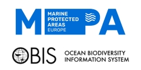

#  Tools for generating SDMs used within the MPA Europe project (obissdm R package)

## About the project

This package is part of the [MPA Europe project](https://mpa-europe.eu/). OBIS led WP3, which aimed to generate distribution maps for marine species and habitats in Europe. `obissdm` holds the core functions used to build that modelling framework: downloading and standardizing occurrence and environmental data, running quality control, fitting and evaluating species distribution models (SDMs), and post-processing the results.

This package is the companion to [iobis/mpaeu_sdm](https://github.com/iobis/mpaeu_sdm), which contains the code that operationalizes these functions into the pipeline used to produce the project's SDMs and stacked SDMs (habitat maps). A more detailed documentation of the modelling framework can be found [here](https://iobis.github.io/mpaeu_docs).

> [!IMPORTANT]
> This was a three-year project, which concluded in 2025. OBIS will continue to develop and improve its SDM framework, so this package may evolve or be superseded in the future. See the [iobis/mpaeu_sdm](https://github.com/iobis/mpaeu_sdm) repository for further notes on replicating the project.

Although the package was created to fulfill the targets of MPA Europe, the functions may be useful for other large-scale projects aiming to produce SDMs of marine species. You can either use the package as is or download and edit the functions to build your own package.

## Installation

To install, use:

``` r
devtools::install_github("iobis/mpaeu_msdm")
```

## What's included

The package functions are organized around the main steps of the modelling framework:

- **Data acquisition**: retrieve occurrence records from OBIS and GBIF and download environmental layers (`mp_get_obis`, `mp_get_gbif`, `mp_get_local`, `get_gbif_keys`, `get_env_data`)
- **Data preparation**: standardize and format occurrence data, and split it into blocks for cross-validation (`mp_standardize`, `mp_prepare_data`, `mp_prepare_blocks`, `split_dataset`)
- **Quality control**: flag geographic and environmental outliers, duplicates, and spatial autocorrelation issues (`outqc_geo`, `outqc_env`, `outqc_dup_check`, `outqc_sac`, `outqc_sac_mantel`)
- **Taxon matching**: resolve species names and keys against WoRMS and GBIF (`name_to_aphia`, `key_to_aphia`, `mp_get_ecoinfo`)
- **Model fitting**: fit SDMs using several algorithms through a common interface, including BRT, ensembles of small models (ESM), GAM, GLM, LASSO, LightGBM, Maxent, Random Forest, and XGBoost (`sdm_fit`, `sdm_module_brt`, `sdm_module_esm`, `sdm_module_gam`, `sdm_module_glm`, `sdm_module_lasso`, `sdm_module_lgbm`, `sdm_module_maxent`, `sdm_module_rf`, `sdm_module_xgboost`, `sdm_multhypo`, `sdm_options`)
- **Model evaluation and ensembles**: evaluate model performance, build ensembles, and inspect response curves and variable importance (`eval_metrics`, `ensemble_models`, `ensemble_eval`, `ensemble_respcurves`, `resp_curves`, `variable_importance`, `variable_importance_esm`, `model_bootstrap`)
- **Post-processing and logging**: prepare final layers, save results, and keep a log of the modelling process (`post_prepare`, `save_sdm`, `gen_log`, `save_log`, `view_log`)
- **Other utilities**: virtual species generation for testing, COG optimization, plotting helpers, and more (`gen_vsp`, `cogeo_optim`, `deband`, `plot_folds`, `plot_leaflet`, `parquet_to`)

Consult the function documentation (`?function_name`) and the [project documentation](https://iobis.github.io/mpaeu_docs) for details on how the pieces fit together within the full pipeline.

## Associated repositories

- [**iobis/mpaeu_sdm**](https://github.com/iobis/mpaeu_sdm): main pipeline that uses this package to produce the SDMs and habitat maps for the MPA Europe project
- [**iobis/mpaeu_docs**](https://github.com/iobis/mpaeu_docs): documentation of the modelling framework
- [**iobis/mpaeu_maps**](https://github.com/iobis/mpaeu_maps): details on data access and how to cite the resulting product

## Citation

If you use this package, please cite it - see [CITATION.cff](CITATION.cff) or use:

``` r
citation("obissdm")
```

## Support

Grant Agreement 101059988 – MPA Europe | MPA Europe project has been approved under HORIZON-CL6-2021-BIODIV-01-12 — Improved science based maritime spatial planning and identification of marine protected areas.

Co-funded by the European Union. Views and opinions expressed are however those of the authors only and do not necessarily reflect those of the European Union or UK Research and Innovation. Neither the European Union nor the granting authority can be held responsible for them.
